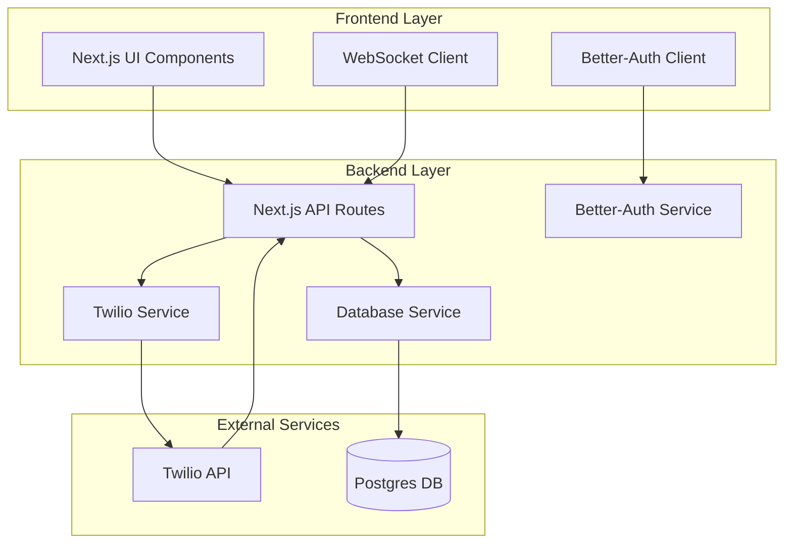

# Design Document

## Overview

The Advanced AMD system is built as a Next.js 14+ application using the App Router with TypeScript. The architecture follows a modular approach with clear separation between authentication, telephony services, database operations, and user interface components. The system integrates Twilio's native AMD capabilities for real-time call analysis and uses Postgres with Prisma for data persistence.

## Architecture



## Components and Interfaces

### Authentication Layer
- **Better-Auth Integration**: Handles user registration, login, and session management
- **Middleware Protection**: Secures API routes and pages requiring authentication
- **Session Management**: Maintains user state across browser sessions

### Telephony Service Layer
- **Twilio Client Wrapper**: Abstracts Twilio SDK operations for call management
- **AMD Handler**: Processes Twilio AMD webhooks and manages detection logic
- **Call State Manager**: Tracks active calls and their current status
- **WebSocket Manager**: Handles real-time communication for call status updates

### Database Layer
- **Prisma Schema**: Defines data models for users, calls, and AMD results
- **Repository Pattern**: Abstracts database operations with type-safe queries
- **Migration Management**: Handles schema changes and data migrations

### User Interface Layer
- **Dial Interface**: Form component for initiating calls with AMD strategy selection
- **Call Status Display**: Real-time status updates during call progression
- **Call History**: Paginated table with filtering and export capabilities
- **Authentication Forms**: Login and registration components

## Data Models

### User Model
```typescript
model User {
  id        String   @id @default(cuid())
  email     String   @unique
  name      String?
  createdAt DateTime @default(now())
  updatedAt DateTime @updatedAt
  calls     Call[]
}
```

### Call Model
```typescript
model Call {
  id              String    @id @default(cuid())
  userId          String
  targetNumber    String
  amdStrategy     String    @default("twilio-native")
  callSid         String?   @unique
  status          CallStatus
  detectionResult DetectionResult?
  confidence      Float?
  duration        Int?      // in seconds
  createdAt       DateTime  @default(now())
  updatedAt       DateTime  @updatedAt
  user            User      @relation(fields: [userId], references: [id])
}

enum CallStatus {
  INITIATED
  RINGING
  ANSWERED
  ANALYZING
  COMPLETED
  FAILED
  NO_ANSWER
  BUSY
}

enum DetectionResult {
  HUMAN
  MACHINE
  UNDECIDED
}
```

## Error Handling

### API Error Responses
- **Standardized Error Format**: Consistent error response structure across all endpoints
- **Error Codes**: Specific codes for different error types (authentication, validation, external service)
- **Logging Strategy**: Comprehensive logging for debugging and monitoring

### Twilio Integration Errors
- **Webhook Validation**: Verify Twilio webhook signatures for security
- **Retry Logic**: Handle temporary Twilio service failures with exponential backoff
- **Fallback Mechanisms**: Graceful degradation when AMD detection fails

### Database Error Handling
- **Transaction Management**: Ensure data consistency during call operations
- **Connection Pooling**: Manage database connections efficiently
- **Migration Safety**: Safe schema updates without data loss

## Testing Strategy

### Unit Testing
- **Service Layer Tests**: Test Twilio service wrapper and AMD logic
- **Database Tests**: Validate Prisma operations and data integrity
- **Utility Function Tests**: Test helper functions and validation logic

### Integration Testing
- **API Route Tests**: End-to-end testing of API endpoints
- **Webhook Tests**: Simulate Twilio webhook payloads
- **Authentication Flow Tests**: Verify login/logout functionality

### AMD Validation Testing
- **Test Numbers**: Use provided voicemail numbers (Costco, Nike, PayPal) for machine detection
- **Human Detection**: Test with personal numbers for human detection accuracy
- **Edge Cases**: Test scenarios like no answer, busy signals, and timeout conditions

## Security Considerations

### Authentication Security
- **Session Management**: Secure session handling with proper expiration
- **CSRF Protection**: Cross-site request forgery prevention
- **Input Validation**: Zod schemas for all user inputs

### API Security
- **Rate Limiting**: Prevent abuse of calling functionality
- **Webhook Security**: Validate Twilio webhook signatures
- **Environment Variables**: Secure storage of API keys and secrets

### Data Protection
- **PII Handling**: Secure handling of phone numbers and user data
- **Database Security**: Encrypted connections and proper access controls
- **Audit Logging**: Track sensitive operations for compliance

## Performance Optimization

### Real-time Communication
- **WebSocket Optimization**: Efficient real-time status updates
- **Connection Management**: Handle WebSocket reconnections gracefully
- **Message Queuing**: Buffer status updates during network issues

### Database Performance
- **Query Optimization**: Efficient queries with proper indexing
- **Connection Pooling**: Optimize database connection usage
- **Caching Strategy**: Cache frequently accessed data

### Twilio Integration
- **Webhook Processing**: Fast webhook response times to prevent timeouts
- **Concurrent Calls**: Handle multiple simultaneous calls efficiently
- **AMD Timeout Handling**: Proper timeout management for detection processes